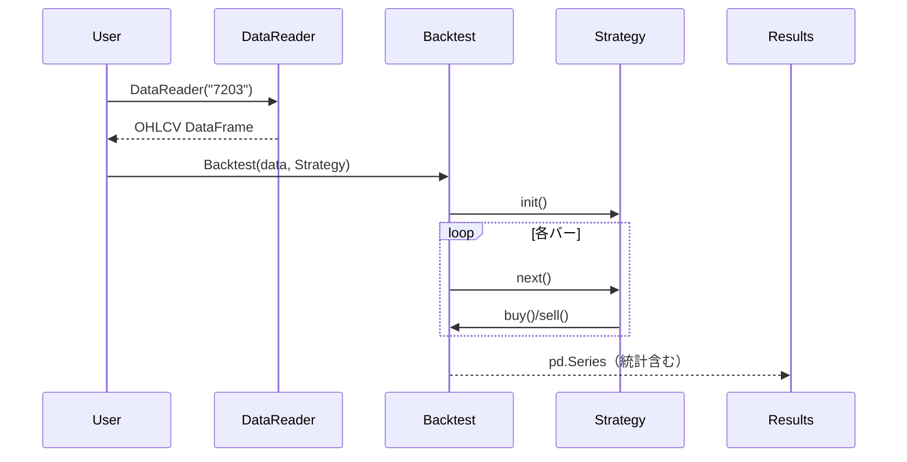

#  チュートリアル

BackcastProを使ったバックテストの基本的な使い方を学びます。

## 目次

1. [インストール](#インストール)
2. [基本的な使い方](#基本的な使い方)
3. [最初の戦略](#最初の戦略)
4. [データの取得](#データの取得)
5. [バックテストの実行](#バックテストの実行)
6. [結果の解釈](#結果の解釈)
7. [次のステップ](#次のステップ)

## インストール（Windows）

```powershell
py -m pip install BackcastPro
```

## 基本的な使い方



### 1. 必要なライブラリのインポート

```python
from BackcastPro import Strategy, Backtest
from BackcastPro.data import DataReader
import pandas as pd
```

### 2. データの準備

```python
# トヨタの株価データを取得
data = DataReader('7203')
print(data.head())
```

## 最初の戦略

### シンプルな買い持ち戦略

最初に、何もしない「買い持ち」戦略を作成してみましょう：

```python
class BuyAndHold(Strategy):
    def init(self):
        # 戦略の初期化（今回は何もしない）
        pass
    
    def next(self):
        # 最初のバーで一度だけ買い
        if len(self.data) == 1:
            self.buy()
```

### バックテストの実行

```python
# バックテストを実行
bt = Backtest(data, BuyAndHold, cash=10000, commission=0.001)
results = bt.run()
print(results)
```

## データの取得

### 日本株データの取得

```python
from BackcastPro.data import DataReader, JapanStocks

# 特定の銘柄のデータを取得
toyota_data = DataReader('7203')  # トヨタ
sony_data = DataReader('6758')    # ソニー

# 期間を指定してデータを取得
from datetime import datetime, timedelta

end_date = datetime.now()
start_date = end_date - timedelta(days=365)  # 1年前

data = DataReader('7203', start_date, end_date)
```

### 銘柄リストの取得

```python
# 日本株の銘柄リストを取得
stocks = JapanStocks()
print(stocks.head())

# 特定の条件でフィルタリング
toyota_info = stocks[stocks['code'] == '7203']
print(toyota_info)
```

### カスタムデータの使用

```python
import pandas as pd

# カスタムデータを作成
custom_data = pd.DataFrame({
    'Open': [100, 101, 102, 103, 104],
    'High': [105, 106, 107, 108, 109],
    'Low': [99, 100, 101, 102, 103],
    'Close': [104, 105, 106, 107, 108],
    'Volume': [1000, 1100, 1200, 1300, 1400]
}, index=pd.date_range('2023-01-01', periods=5))

# バックテストで使用
bt = Backtest(custom_data, BuyAndHold)
results = bt.run()
```

## バックテストの実行

```python
bt = Backtest(
    data,
    BuyAndHold,
    cash=10000,
    commission=0.001,
    finalize_trades=True,
)
results = bt.run()
```

> 複数戦略の比較や最適化の例は `examples/` と「高度な使い方」を参照してください。

## 結果の解釈

### 基本的な統計情報

```python
results = bt.run()

# 主要な統計情報を表示
print(f"総リターン: {results['Return [%]']:.2f}%")
print(f"年率リターン: {results['Return (Ann.) [%]']:.2f}%")
print(f"シャープレシオ: {results['Sharpe Ratio']:.2f}")
print(f"最大ドローダウン: {results['Max. Drawdown [%]']:.2f}%")
print(f"取引回数: {results['# Trades']}")
print(f"勝率: {results['Win Rate [%]']:.2f}%")
```

### エクイティカーブの確認

```python
# エクイティカーブを取得
equity_curve = results['_equity_curve']
print(equity_curve.head())

# ドローダウンを確認
drawdown = equity_curve['DrawdownPct']
print(f"最大ドローダウン: {drawdown.min():.2f}%")
```

### トレード履歴の確認

```python
# トレード履歴を取得
trades = results['_trades']
print(trades.head())

# 勝ちトレードと負けトレードを分析
winning_trades = trades[trades['PnL'] > 0]
losing_trades = trades[trades['PnL'] < 0]

print(f"勝ちトレード数: {len(winning_trades)}")
print(f"負けトレード数: {len(losing_trades)}")
print(f"平均勝ち: {winning_trades['PnL'].mean():.2f}")
print(f"平均負け: {losing_trades['PnL'].mean():.2f}")
```

## 次のステップ

### 1. より複雑な戦略の実装

```python
class MovingAverageCross(Strategy):
    def init(self):
        # 移動平均を計算
        self.data['SMA_short'] = self.data.Close.rolling(10).mean()
        self.data['SMA_long'] = self.data.Close.rolling(20).mean()
    
    def next(self):
        # ゴールデンクロスで買い、デッドクロスで売り
        if (self.data.SMA_short.iloc[-1] > self.data.SMA_long.iloc[-1] and
            self.data.SMA_short.iloc[-2] <= self.data.SMA_long.iloc[-2]):
            self.buy()
        
        elif (self.data.SMA_short.iloc[-1] < self.data.SMA_long.iloc[-1] and
              self.data.SMA_short.iloc[-2] >= self.data.SMA_long.iloc[-2]):
            self.sell()
```

### 2. リスク管理の追加

`buy()` / `sell()` の `sl` と `tp` を活用できます（詳細は API リファレンス参照）。

### 3. パフォーマンスの可視化

```python
import matplotlib.pyplot as plt

# エクイティカーブをプロット
equity_curve = results['_equity_curve']
plt.figure(figsize=(12, 6))
plt.subplot(2, 1, 1)
plt.plot(equity_curve.index, equity_curve['Equity'])
plt.title('エクイティカーブ')
plt.ylabel('資産')

plt.subplot(2, 1, 2)
plt.plot(equity_curve.index, equity_curve['DrawdownPct'])
plt.title('ドローダウン')
plt.ylabel('ドローダウン (%)')
plt.xlabel('日付')

plt.tight_layout()
plt.show()
```

### 4. Streamlitでの可視化

```python
# Streamlitアプリの作成
import streamlit as st

st.title('バックテスト結果')
st.write('戦略:', 'MovingAverageCross')
st.write('総リターン:', f"{results['Return [%]']:.2f}%")

# エクイティカーブを表示
st.line_chart(equity_curve[['Equity']])

# トレード履歴を表示
st.dataframe(trades)
```

## よくある質問

### Q: データが取得できない場合はどうすればいいですか？

A: 以下の点を確認してください：
1. インターネット接続
2. 銘柄コードの正確性
3. 日付範囲の妥当性

### Q: バックテストが遅い場合はどうすればいいですか？

A: 以下の方法を試してください：
1. データ期間を短くする
2. 複雑な計算を`init()`で事前計算する
3. 不要なデータを削除する

### Q: 結果が期待と異なる場合はどうすればいいですか？

A: 以下の点を確認してください：
1. データの品質
2. 戦略ロジックの正確性
3. パラメータ設定の妥当性

## まとめ

- インストール → データ取得 → 戦略実装 → 実行 → 分析、の順に進めます
- 詳細は「APIリファレンス」「高度な使い方」「サンプルコード」を参照してください
